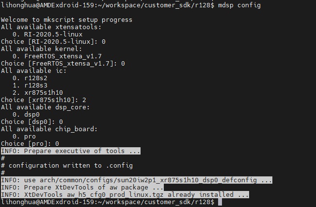

## 工程使用说明
#### 1、编译步骤
```
source envsetup.sh    //选择编译环境

lunch_rtos 35        //选择编译平台m33
mrtos_menuconfig       //可修改配置
m                    //编译
ota_mrtos clean
ota_mrtos             //编译ota固件
lunch_rtos 34        //选择编译平台c906
mrtos_menuconfig       //可修改配置
m                    //编译
pack                 //打包固件
```

#### 2、查看堆栈信息
- 在工程目录下新建一个文本文件，放堆栈地址(死机时打印的堆栈地址直接拷贝)，如下所示：
    ```
    // ./backtrace.txt
    backtrace : 0X0C4A24E6 
    backtrace : 0X0C4A25B2 
    backtrace : 0X0C462E06 
    backtrace : 0X0C44ABCE 
    backtrace : 0X0C44CA6A 
    backtrace : 0X0C44CD44 
    backtrace : 0X10001F78 
    backtrace : 0X100001AA 
    backtrace : 0X100009CE 
    backtrace : 0X0C4A26C6

    ```
- 执行命令
    ```
    callstack backstrack.txt
    ```
#### 3、基于全志服务器的DSP编译

#### 说明：
    1、使用全志提供的电脑
    2、目标服务器地址：192.168.201.159
    3、密码：QWE!@#456
    4、SDK位置：workspace/customer_sdk/r128
    5、在上述SDK路径中添加了最新项目代码:/xiaogu

#### 编译命令：
    1、source envsetup.sh   // 选择编译环境
    2、lunch_rtos           // 对应的M33或906都行，但要提前编译对应的核
    3、mdsp config          // 选择配置，参考下图


    4、mdsp menuconfig      // 选择配置（可忽略）
    5、mdsp                 // 编译固件

#### debug
    1、编译过程中如果出现报错，尤其是"NO such file or dictionary", 定位到ERROR 1的文件，自行添加一个回车，若原有多余的，可以删除
    2、每次编译会自动clean，不用额外考虑
    3、如果发现奔溃，dsp的backtrace需要这么操作
        cd lichee/dsp/
        ./backtrace.sh b.txt

